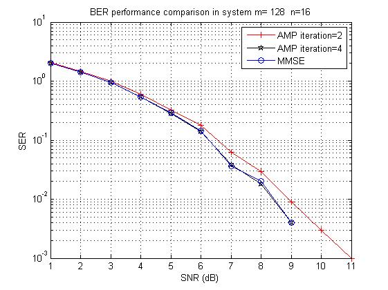
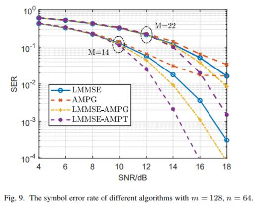

# AMP-in-MIMO
**Approximate Message Passing (AMP) for Massive MIMO Detection**

## File Descriptions

- **AMPG.m:** Implements the AMP algorithm using Gaussian distributions for the prior symbols.

- **AMPT.m:** Implements the AMP algorithm using the discrete set {0,1,-1} for the prior symbols.

- **main_AMPG_LMMSE.m:** A stand-alone script that plots the Symbol Error Rate (SER) performance of the AMPG algorithm and Linear MMSE (LMMSE) detection.

- **main_massive_detection.m:** The main script comparing the SER performance of hybrid decoding methods using LMMSE combined with AMPG or AMPT.

## Copyright
If you use these codes in your research, please acknowledge our work by citing the following paper:

Shanxiang Lyu, Cong Ling: *Hybrid Vector Perturbation Precoding: The Blessing of Approximate Message Passing*. IEEE Trans. Signal Process. 67(1): 178-193 (2019).

## Maintainer

- **Shanxiang Lyu**  
  Associate Professor, Jinan University, Guangzhou  
  Email: [shanxianglyu@gmail.com](mailto:shanxianglyu@gmail.com)  
  Homepage: [https://sites.google.com/view/shanx](https://sites.google.com/view/shanx)

## History

These files were originally posted on my personal website and on MATHWORKS. The initial version (edition-1) was made available on my website [here](http://www.commsp.ee.ic.ac.uk/~slyu/approximate-message-passing-amp-for-massive-mimo-detection-matlab-codes-provided/index.html), and edition-2 was uploaded to [MATLAB Central](https://www.mathworks.com/matlabcentral/fileexchange/69206-approximate-message-passing-amp-for-massive-mimo-detection).

The development of this project began during my Ph.D. studies in 2014, where one of my research projects involved applying the AMP algorithm to solve the Closest Vector Problem (CVP) of lattices—a problem that includes the well-known MIMO detection problem as a special case. My initial goal was to understand the technical paper *"The Dynamics of Message Passing on Dense Graphs, with Applications to Compressed Sensing"* by Mohsen Bayati and Andrea Montanari (IEEE TIT, 2011), referred to as BM11. I subsequently derived the set of equations used in AMP by simplifying Belief Propagation, which is detailed in Section IV of the 2019 IEEE TSP paper mentioned above.

Regardless of the AMP version, a critical step in MIMO detection involves assigning the a priori distribution to the vector "x" in the equation "y = H*x + n". While the transmission vector "x" follows a uniform distribution over QAM symbols, for detection, we may assume that "x" follows a Gaussian distribution, which is later quantized to obtain discrete QAM symbols. This approach is implemented in the AMPG algorithm, which is remarkably simple, consisting of only three lines of code. While AMPG slightly differs from the algorithm presented in BM11, the underlying principles remain the same.

In 2015, Jeon and Studer introduced AMP-exact, an algorithm using the exact prior distribution in AMP, which outperforms AMPG in SER performance. I posted the first edition of the codes on my personal website in 2015. By 2017, to address AMP-exact's limitations when the range of “x” is large (e.g., beyond ±1 and for small QAM constellations), I developed a two-step procedure. This method first employs a low-complexity algorithm to estimate "x" and, if the estimate is reasonably accurate, AMP is applied with a reduced range of prior symbols. In the simplest case, this involves using the set {0,1,-1} for "x", leading to the AMPT algorithm. Although this hybrid decoding algorithm performs well in MIMO detection, its application to MIMO precoding is broader, as discussed in Section VII of the IEEE TSP 2019 paper.
